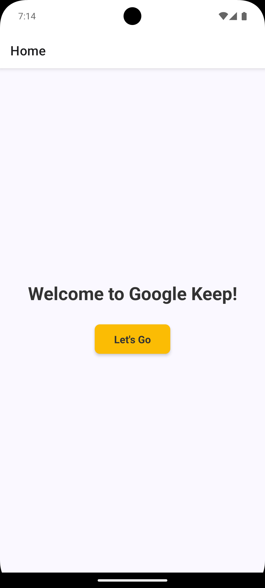
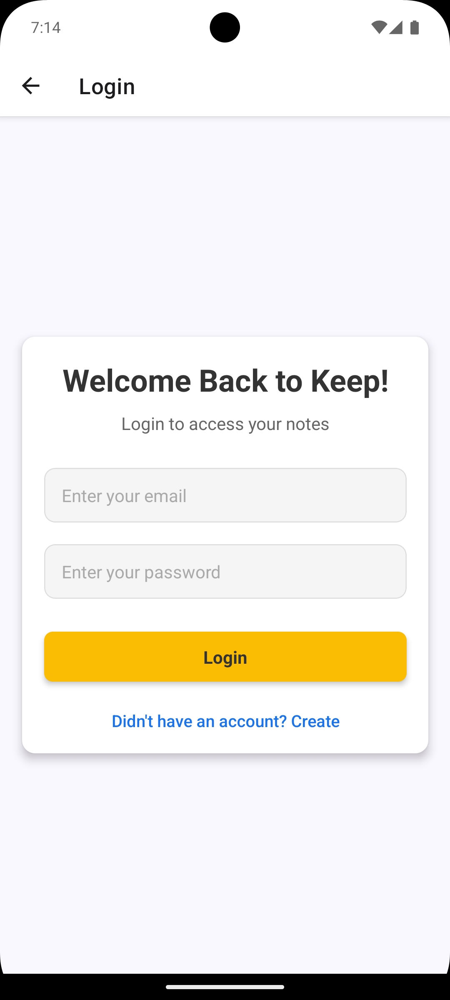
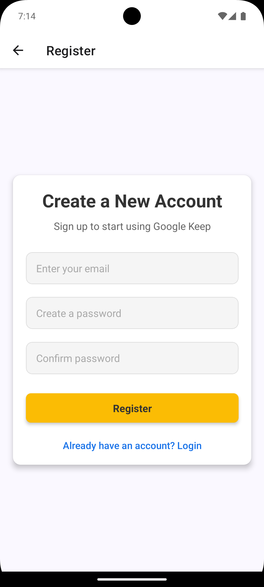
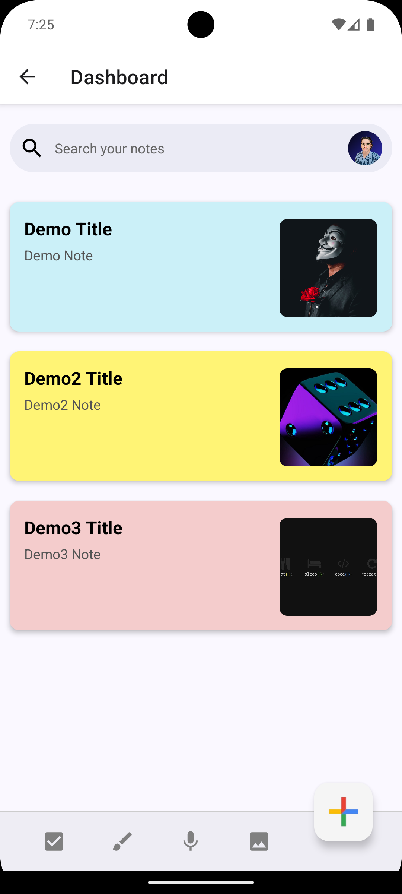

# 🌟 Google Keep Clone App 🌟

This repository contains the frontend for the **Google Keep Clone App**, a coursework project for **Advanced Mobile Application Development** as part of the GDSE66 program at IJSE. It replicates key functionalities of Google Keep, providing a feature-rich, cross-platform note-taking application using React Native and Expo.

## 🛠️ Tech Stack

✅ **React Native**: For building the mobile interface. 
✅ **Expo**: Streamlines React Native development and deployment. 
✅ **Firebase**: Provides secure authentication and media storage. 

## 🚀 Features

✅ **User Authentication**: Secure login and registration via Firebase Authentication. 
✅ **Note Creation & Organization**: Users can create, read, update, and delete notes with color-coding options for visual organization. 
✅ **Task Lists**: Add task lists within notes to keep track of to-dos. 
✅ **Reminders**: Set reminders on notes for notifications about important tasks or events. 
✅ **Search Functionality**: Quickly locate notes using a search feature that scans through note content and labels. 
✅ **Media Attachments**: Allow users to attach images to notes, with media stored securely via Firebase Storage. 

## 📸 Screenshots

  <table>
    <tr>
      <td align="left">
      
Home

        
      </td>
      <td align="left">
      
Login

        
      </td>
    </tr>
    <tr>
      <td align="left">
      
Register

        
      </td>
      <td align="left">
      
Dashboard

        
      </td>
    </tr>
    <tr>
      <td align="left">
      
Note Creation

        
      </td>
      <td align="left">
      
Note List

        
      </td>
    </tr>
  </table>

## 📝 Version

**1.0.0**

## 📬 Get in Touch

For questions or assistance, feel free to reach out!

📧 [kavithmathushal9007@gmail.com](mailto:kavithmathushal9007@gmail.com)

#### This project is licensed under the [GNU License](LICENSE)

#### © 2024 All Rights Reserved | Designed by [Kavithma Thushal](https://github.com/Kavithma-Thushal)

